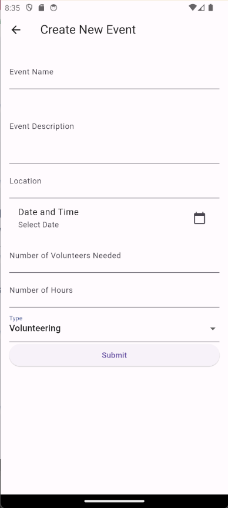
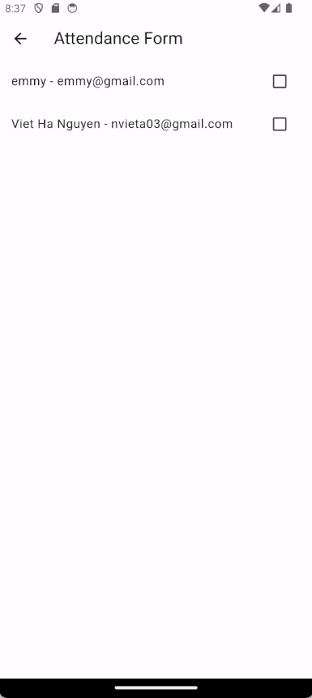

# Biggest At Heart mobile app
## Overview
Biggest At Heart is a mobile app that supports volunteer management specifically for Big At Heart organisation. This app aims to provide multiple functions for volunteers to easily access volunteering opportunities, reflections, volunteering hours, as well as for admins to manage volunteers' data to generate insightful reports. Moreover, this app allows volunteers to auto-generate certificates based on reliable and transparent data captured in Firestore database. This relieves admins from manually verifying the hours and increases operational efficiency.

## Prototype

To try out our prototype, please download the apk under our releases and run it on an Android device or emulator. [Click Here](https://github.com/aemeeeee/biggestatheart/releases)

To test the admin features, you can sign in using this test account:
 
**Username**: admintest@gmail.com
 
**Password**: adminTest!

## Table of Contents
- [Biggest At Heart mobile app](#biggest-at-heart-mobile-app)
  - [Overview](#overview)
  - [Table of Contents](#table-of-contents)
    - [User Sign Up](#user-sign-up)
    - [User Log In](#user-log-in)
    - [Home Page](#home-page)
    - [Activity Gallery](#activity-gallery)
    - [Blog/Reflection](#blogreflection)
    - [Request Certificate (Volunteer users only)](#request-certificate-volunteer-users-only)
    - [View Reports (Admin users only)](#view-reports-admin-users-only)
      - [By individual volunteers](#by-individual-volunteers)
      - [By month/type of activity](#by-monthtype-of-activity)
    - [Honor Roll](#honor-roll)

### User Sign Up

When a new user is brought to the login page without an account, he or she can click on the `Sign Up` button at the bottom of the screen to navigate to a sign up page. 

There, new users will go through 3 separate pages of forms to input their personal information as well as other fields such as interests, skills and preferences as shown above. For security purposes, user's password must be **at least 8 characters, including 1 uppercase character, and 1 special character**.

Upon successful sign up, users will be navigated back to the Log In page.

[Back to table of contents](#table-of-contents)

### User Log In

User can log in to their account by keying in their email and password, then clicking on `Log In` button.

Upon successful log in, users will be navigated to their Home page.

[Back to table of contents](#table-of-contents)

### Home Page

Upon successful login, users will be navigated to their respective home page. It should display their respective profile picture and user name on the top, and a list of volunteering activities that they have enrolled in. Users can click on these activities to view the details of the activities. 

Users can log out of their account by clicking on the `logout` button at the top right of the home page.

Users can navigate to the following pages by clicking on one of the four buttons in the bottom navigation bar:
- `Upload Post Page` - Users can upload a reflecton/sharing/blog 
- `Activity Gallery Page` - Users can view the list of upcoming activities
- `Blog Feed Page` - Users can view others' reflection/sharing
- `Generate Certificate Page` **OR** `View Reports Page` - Depending on whether the user is a normal volunteer or an admin user, the corresponding button and navigation will be shown. For normal users, clicking on the `Generate Certificate Page` will allow them to download a pdf version of a certificate for their volunteering work. For admin users, clicking on the `View Reports Page` will bring allow them to view different types of reports.

**Note**: For details on the respective pages, check out the detailed guide under each feature.

[Back to table of contents](#table-of-contents)

### Activity Gallery

Upon clicking the second icon on the bottom navigation bar, users will be redirected to the `Activity Gallery`, where users can view all available upcoming volunteering opportunities with their event names and locations.

#### a. Post a new activity (Admin-only)

Admin users will be able to view a `+` icon on the right of top navigation bar, which will lead them to a `Post a New Activity` page. Admin users can proceed to enter the details of the new activity before clicking `Submit`, which will add the newly created activity to the `Activity Gallery` for volunteers to view.

#### b. View details of volunteering activities

On the `Activity Gallery`, users can click on each activity to view it in their respective `Activity Page` in further detail, such as the number of volunteers needed and the number of hours involved.

#### c. Enrol in a new activity (Volunteer-only)

Once entering the `Activity Page`, volunteers will see the button `Enrol` should they wish to sign up for that volunteering opportunity. After clicking `Enrol`, volunteers cannot click that button again and will only see a message "You are already enrolled in this activity." upon revisiting the activity.

#### d. Take attendance of volunteers (Admin-only)

Unlike volunteers, admin users will see the button `Take Attendance` instead upon entering the respective `Activity Page`. After clicking the button, admins can see a list of signed up participants and take their attendance by clicking the checkbox next to each participant's name.

[Back to table of contents](#table-of-contents)

### Blog/Reflection

 

User can navigate to the Blog Feed page where he/she can view all blog/reflection posts uploaded by other users by clicking on the `Blog Feed Page` button (third button at the bottom navigation bar). At this page, for each post, user can see:
- author of post
- title of post
- date of post

User can click on the `Add Post` button (Plus sign) on the right side of the top navigation bar at this page to upload a blog/reflection post. Upon clicking, user will be navigated to the Upload Post page, where users can type the title and the caption of the post. To delete the whole field fast, user can click on the `Delete` button ('X' mark) at the end of each field. 

When user finishes crafting his/her post, he/she can click on the `Upload` button below the fields to upload it. Upon successful uploading, user will be notified with a pop-up message and a `Back to Blog Feed` button, and their post will be displayed on the Blog Feed.

User can also click on a post on the Blog Feed to view its details. Upon clicking on a post, user will be navigated to the Post Details page, where he/she can see the caption of the post, in addition to the details displayed on Blog Feed page.

In future implementations, user should be able to interact with the posts by clicking on the `Like` button, and leaving comments on the post.

[Back to table of contents](#table-of-contents)

### Request Certificate (Volunteer users only)

 

User can request for a certificate by clicking on the `PDF` button on the bottom navigation bar (fourth botton). Upon clicking, user will be navigated to the Preview page of their certificate. The certificate consists of the following component:
- Logo of the organisation
- Name of user
- Total number of volunteering hours (real-time data as of the moment the certificate is requested)
- Date of issuance
- Signature

To download and save the certificate as PDF to his/her device, user can click on the blue `PDF` button on the top right corner of the screen. The PDF certificate can be found under the Files application on the user's phone. An example of the PDF certificate successfully generated and downloaded to device is shown above.

[Back to table of contents](#table-of-contents)

### View Reports (Admin users only)

Admin Users can view reports and statistics regarding the volunteers in 3 ways: 
- By individual 
- By demographics (feature coming soon)
- By month/type of activity

#### By individual volunteers

Admin users can view the entire list of registered volunteers arranged alphabetically by their names. Each volunteer's email and phone number is also shown below their name. Admin users can search for specific volunteers by searching for the user's name in the search bar at the top of the screen.

Clicking on a specific volunteer will display a page with more detailed report for that particular volunteer. Admin can also select a time range and view all activities attended by the user within that period of time, along with each activity's date and duration.

#### By month/type of activity

    

Admin users can select between viewing statistical report by month via a date picker or by the one of the 3 types of activity (Volunteering, Training, Workshop) through a drop down menu.

### Honor Roll

On the top navigation bar of Home Page, users can click the `Trophy icon` on the left corner to access the `Honor Roll`. The organisation can choose to display Volunteer with Most Activities (demo), Volunteer with Most Insightful Posts and so on, in order to recognise their commitment and encourage long-term involvement with the organisation and the beneficiaries.

[Back to table of contents](#table-of-contents)
